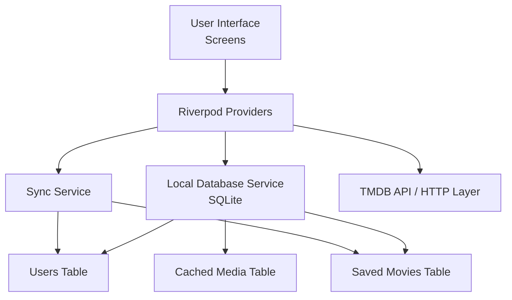

# Movie App

Movie App is a Flutter-based movie discovery and profile experience that combines TMDB movie data with a local-first user profile flow. Users can browse movies create profile cards, save movies to those profiles, and view shared interests across profiles.

## What the app does

The app is built around two core ideas:

- Discover movies from the TMDB API.
- Organize that content around personal profiles, so each profile can maintain its own saved movie list.

### Main user flows

- Browse trending, top-rated, and popular media.
- Open a details screen for a selected movie.
- Create a user/profile and assign it a movie taste description.
- Save movies for a specific profile.
- View matches and top-pick highlights based on shared saved movies.
- Handle offline-friendly behavior using a local SQLite database and sync logic.

## Project structure

The application is organized under the standard Flutter structure:

- [lib/main.dart](lib/main.dart) — app entry point and theme initialization.
- [lib/screens](lib/screens) — all screen-level UI, including the user list, details, matches, and add-user flow.
- [lib/providers](lib/providers) — Riverpod state management for users, saved movies, sync status, and connectivity.
- [lib/services](lib/services) — database access and sync services.
- [lib/models](lib/models) — domain models such as users, saved movies, and movie details.
- [lib/theme](lib/theme) — shared colors, typography, and app theme.
- [lib/utils](lib/utils) — responsive helpers and small reusable utilities.
- [lib/widgets](lib/widgets) — reusable UI components such as loading states.

## Architecture overview

The app follows a simple layered architecture that keeps UI, state, and persistence separated.



### How the layers interact

- The screens request data through providers.
- Providers decide whether to read from the local database, refresh from the API, or trigger sync.
- SQLite stores the user profiles, saved movie relationships, and locally cached media.
- The sync layer handles reconnecting the local changes to the backend when internet access is available.

## Design system

The UI uses a custom dark theme rather than relying on the default Material styling alone.

### Key design choices

- A custom color palette is defined in [lib/theme/app_colors.dart](lib/theme/app_colors.dart).
- Typography is centralized in [lib/theme/app_fonts.dart](lib/theme/app_fonts.dart) using Google Fonts.
- The app theme is configured in [lib/theme/app_theme.dart](lib/theme/app_theme.dart) with a dark Material 3 look.
- Responsive sizing is handled through [lib/utils/responsive.dart](lib/utils/responsive.dart) so spacing and text scaling adapt better across screen sizes.

This keeps the UI consistent while still allowing each screen to manage its own layout details.

## Local database design

The app uses SQLite through the sqflite package. The database is created in [lib/services/local_database_service.dart](lib/services/local_database_service.dart) and is the app’s local source of truth for profiles and saved content.

### Tables

- users
  - Stores profile information such as localId, remoteId, firstName, lastName, email, avatar, sync status, and creation timestamp.
  - Each user/profile is represented as a local row and can be created even when the app is offline.

- saved_movies
  - Stores a saved movie for a specific user profile.
  - Each row contains the movie metadata, the userLocalId foreign reference, and an isSynced flag.
  - A unique constraint on (userLocalId, movieId) prevents the same movie from being saved twice for the same profile.

- cached_media
  - Stores fetched movie/TV pages so the app can continue showing previously loaded content when the device is offline.

### User → saved movies relationship

The relationship is intentionally simple:

- A user row in the users table can have many rows in the saved_movies table.
- Each saved_movies row points back to one user through userLocalId.

This design powers the user list’s saved-count badge, the details screen’s “users who saved this movie” view, and the matches page. The saved count shown for a profile is computed from the saved_movies rows linked to that profile.

## Important implementation decisions

A few behaviors are important because they are not obvious from the UI alone:

- The app is local-first. Profiles and saved movies are written to SQLite immediately, so the UI updates without waiting for a network response.
- The users list is refreshed from the local database after save/remove actions so the saved count updates instantly.
- Syncing is handled separately through [lib/services/sync_service.dart](lib/services/sync_service.dart). Pending users and pending saved movies are posted when connectivity is available.
- The app uses Riverpod for state management, including provider-based updates for users, sync state, and movie save actions.
- The app mixes remote API content (TMDB) with local app state, which is why some features still work smoothly when the network is temporarily unavailable.

## Getting started

### Prerequisites

- Flutter SDK
- A connected device or emulator
- TMDB API access configured in the app constants

### Install dependencies

```bash
flutter pub get
```

### Run the app

```bash
flutter run
```

## Screenshots

Add screenshots to the repository in a folder such as `screenshots/` and reference them like this:

```md


```

Recommended screenshots to include:

- Home or user list screen
- Movie details screen
- Add profile screen
- Matches / shared-interest screen
- A profile with saved movies visible
